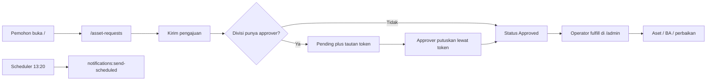
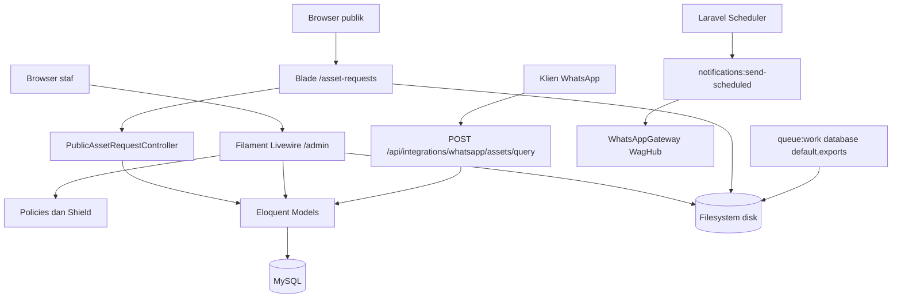

<p align="center">
  
</p>

<h1 align="center">Shelf</h1>

<p align="center">
  Sistem manajemen aset berbasis web untuk inventaris, pengajuan publik,
  approval berbasis token, transfer dan berita acara, rekonsiliasi audit,
  checksheet kendaraan, serta pengingat dokumen.
</p>

Shelf menyediakan dua jalur penggunaan utama:

- **Form pengajuan publik** di `/` (diarahkan ke `/asset-requests`) untuk pengadaan, penarikan, dan perbaikan, plus halaman status dan approval berbasis token.
- **Panel staf Filament** di `/admin` untuk operasional aset, master data, transfer/BA, rekonsiliasi, checksheet kendaraan, tugas, dan pengguna.

Ada juga endpoint integrasi WhatsApp `POST /api/integrations/whatsapp/assets/query` (saat ini tanpa autentikasi; lihat peringatan di bawah).

Bahasa utama aplikasi adalah Bahasa Indonesia (locale `id`) dan seluruh perhitungan waktu menggunakan zona waktu `Asia/Jakarta`.

> [!IMPORTANT]
> Tautan approval publik (`/asset-requests/approval/{token}`) **tidak** memverifikasi identitas orang yang membuka tautan. Siapa pun yang memiliki token dapat menyetujui atau menolak. `POST /api/integrations/whatsapp/assets/query` juga tanpa middleware auth; tes saat ini memperlakukannya sebagai publik. Jangan membuka endpoint itu ke internet tanpa kontrol jaringan. Reset password panel Filament dimatikan (`passwordReset(null, null)`).

## Daftar isi

- [Tujuan dan scope](#tujuan-dan-scope)
- [Fitur utama](#fitur-utama)
- [Role dan hak akses](#role-dan-hak-akses)
- [Cara kerja aplikasi](#cara-kerja-aplikasi)
- [Arsitektur](#arsitektur)
- [Tech stack](#tech-stack)
- [Persiapan development](#persiapan-development)
- [Konfigurasi environment](#konfigurasi-environment)
- [Menjalankan aplikasi](#menjalankan-aplikasi)
- [Workflow development](#workflow-development)
- [Testing dan quality check](#testing-dan-quality-check)
- [Batasan dan technical debt](#batasan-dan-technical-debt)
- [Troubleshooting](#troubleshooting)

## Tujuan dan scope

Shelf menyatukan pencatatan aset dengan pengajuan dari pemohon. Alur utamanya dimulai dari form publik, approval per divisi (atau auto-approve bila divisi belum punya approver), tindak lanjut operator di panel, lalu dokumen BA, rekonsiliasi, checksheet kendaraan, dan pengingat masa berlaku dokumen.

### Termasuk dalam scope

- Form pengajuan publik di `/asset-requests` (`GET /` mengarah ke sana) untuk jenis `pengadaan`, `penarikan`, dan `perbaikan`.
- Halaman progress publik `/asset-requests/status/{token}` dan approval `/asset-requests/approval/{token}`.
- Panel Filament di `/admin`: aset, pengajuan, transfer, rekonsiliasi (CSA dan audit kendaraan), checksheet kendaraan, atribut kustom, tugas, vendor, dan master data.
- Role Shield `super_admin` plus role operasional `general_affair` (penerima penarikan, jenis dokumen BA, perbaikan).
- Login panel dengan username atau email di `/admin/login`. Registrasi mandiri, reset password, dan halaman profil default Filament dimatikan.
- Unduhan PDF berita acara / pengadaan / penyelesaian tugas (hanya user terautentikasi).
- Pengingat dokumen terjadwal (`notifications:send-scheduled` setiap hari pukul 13:20) plus `model:prune` harian.
- Gateway WhatsApp WagHub (`WAG_URL` + `WAG_TOKEN`) untuk notifikasi pengajuan dan pengingat.
- Query aset dari integrasi WhatsApp: `shelf.search_asset`, `shelf.asset_history`, `shelf.expiring_documents`.
- Health check Laravel di `/up`.

### Di luar scope implementasi saat ini

- Aplikasi mobile terpisah; pemohon memakai form Blade publik, staf memakai panel Filament.
- Produk REST API domain. `routes/api.php` hanya mengekspos `GET /api/user` (Sanctum) dan `POST /api/integrations/whatsapp/assets/query` (tanpa auth).
- Role operasional `general_affair` dan `admin` **tidak** dibuat oleh seeder; hanya akun Shield `super_admin` yang di-seed.
- Pipeline CI/CD, image container, atau orkestrasi Compose di repositori ini.

## Fitur utama

Ketersediaan modul pada setiap surface saat ini:

| Modul | Form `/asset-requests` | Panel `/admin` | Integrasi WhatsApp | Keterangan |
|---|:---:|:---:|:---:|---|
| Pengajuan pengadaan / penarikan / perbaikan | Ya | Ya | Tidak | `POST /asset-requests` dibatasi `throttle:public` (5/menit per IP, dilepas saat testing) |
| Status pengajuan (token) | Ya | Ya | Tidak | `/asset-requests/status/{token}` |
| Approval pengajuan (token) | Ya | Ya | Tidak | Token bukan bukti identitas approver |
| Inventaris aset | Tidak | Ya | Query | Kondisi: Tersedia, Digunakan, Dijual, Hilang, Rusak; NBH pending/selesai |
| Transfer aset dan BA | Tidak | Ya | Tidak | BA / BAPAB / BAPEB dari peran `general_affair`; unduh PDF butuh auth |
| Rekonsiliasi / audit | Tidak | Ya | Tidak | CSA (stok) dan VEHICLE_AUDIT (plat); apply koreksi terpisah dari import |
| Checksheet kendaraan | Tidak | Ya | Tidak | Resource Filament plus import/export |
| Atribut kustom dan pengingat dokumen | Tidak | Ya | Query kedaluwarsa | Scheduler `notifications:send-scheduled` |
| Tugas (task) | Tidak | Ya | Tidak | PDF penyelesaian tugas butuh auth |
| Master data | Tidak | Ya | Tidak | Kategori, badan usaha, jabatan, merek, lokasi, divisi+approver, vendor, pengguna |
| Pengguna dan role | Tidak | Ya | Tidak | Permission Filament Shield; masuk panel hanya jika user punya role |
| Query aset WhatsApp | Tidak | Tidak | Ya | `POST /api/integrations/whatsapp/assets/query` tanpa auth |

> [!NOTE]
> Detail operasional atribut kustom (STNK, KIR, dan sejenisnya) ada di [`docs/cara-kerja-custom-attribute-pengingat-dokumen.md`](docs/cara-kerja-custom-attribute-pengingat-dokumen.md). Jejak keputusan rekonsiliasi ada di `docs/chain-of-truth/`.

## Role dan hak akses

Hak akses panel ditentukan permission Filament Shield pada masing-masing role, lalu dipersempit oleh policy di [`app/Policies`](app/Policies). Nama role saja tidak cukup.

`User::canAccessPanel()` mengizinkan masuk `/admin` hanya jika user memiliki minimal satu role. Login memakai field **Username or Email**.

### Akses efektif

| Aktor | Akses utama |
|---|---|
| `super_admin` | Role Shield; seeder menugaskannya ke akun Super Admin. Bypass Gate Pulse (`viewPulse`) hanya untuk role ini. |
| `general_affair` | Role operasional: penerima wajib pada fulfillment penarikan, penentu jenis dokumen BA, dan aksi perbaikan aset. **Tidak** di-seed. |
| `admin` | Target permission `export_asset` bersama `general_affair` (`EnsureAssetExportPermissions`). **Tidak** di-seed. |
| Pemohon form publik | Tidak memakai panel. Pengajuan baru dapat membuat/memakai baris `users` (nama, WhatsApp, email) tanpa menugaskan role, sehingga akun itu tidak otomatis masuk `/admin`. |
| Approver publik | Memutuskan lewat token; bukan login panel. |

### Akun uji development

Kredensial berikut hanya dibuat oleh `php artisan db:seed` / `migrate --seed` ketika `SEED_SUPER_ADMIN_PASSWORD` kosong **dan** lingkungan bukan production. Di production, seeder melewati pembuatan akun ini kecuali password seed di-set. Jangan mempertahankan kata sandi tetap ini pada lingkungan production.

| Nama seed | Username | Email | Role | Kata sandi |
|---|---|---|---|---|
| Super Admin | `admin` | `admin@dev.com` | `super_admin` | `password` |

Override lewat `SEED_SUPER_ADMIN_USERNAME`, `SEED_SUPER_ADMIN_EMAIL`, `SEED_SUPER_ADMIN_NAME`, dan `SEED_SUPER_ADMIN_PASSWORD` (variabel ini tidak tercantum di `.env.example`). Seeder juga menjalankan `shield:generate` lalu Category, Business Entity, Job Title, dan Brand. `AssetLocationSeeder` dan `AssetSeeder` tidak dipanggil.

Role `general_affair` harus dibuat dan ditugaskan manual sebelum alur penarikan/BA dapat berjalan utuh.

## Cara kerja aplikasi



### 1. Form publik

`GET /` mengarah ke `GET /asset-requests`. Pemohon memilih jenis:

| Jenis | Tujuan | Hasil operator |
|---|---|---|
| Pengadaan | Meminta aset baru (bisa multi-item) | Aset dibuat per item; pengajuan selesai setelah semua item terpenuhi |
| Penarikan | Mengembalikan aset pemegang ke General Affairs | BA Pengembalian; aset ke user ber-role `general_affair` |
| Perbaikan | Mengajukan aset rusak | Aset ditandai Rusak / NBH Pending |

Pengadaan boleh mengisi pemohon baru (nama, WhatsApp, email, jabatan). Penarikan dan perbaikan wajib memilih pemohon terdaftar dan aset yang eligible. Lampiran minimal satu file (jpeg/jpg/png/pdf/doc/docx/xls/xlsx, maks. 10 MB per file). `POST` publik memakai `throttle:public`.

Setelah tersimpan, sistem membuat `reference_number` dan `public_token`, merakit rantai approval dari `division_approvers` (urut `level`), dan mengirim notifikasi WhatsApp/email bila kontak tersedia.

### 2. Approval berbasis token

- Progress: `/asset-requests/status/{token}` pada `public_token` pengajuan.
- Keputusan: `/asset-requests/approval/{token}` pada token baris `asset_request_approvals`.
- `POST .../approve` dan `POST .../reject` juga di-throttle. Penolakan wajib mengisi catatan.
- Jika divisi tidak punya approver, status langsung `approved` tetapi tetap menunggu tindak lanjut operator (`fulfilled_at`).

Token adalah rahasia tautan, bukan login. Perlakukan URL approval seperti kredensial.

### 3. Tindak lanjut di panel

Operator di `/admin` (resource Asset Requests) men-fulfill sesuai jenis. Pengajuan baru dianggap selesai setelah fulfillment, bukan sekadar approval. Aset dengan pengajuan penarikan/perbaikan aktif tidak boleh diproses ganda.

### 4. Transfer dan berita acara

Resource Asset Transfers mencatat mutasi pemegang. Jenis dokumen diturunkan dari peran `general_affair`:

- **BA** serah terima (dari GA ke non-GA)
- **BAPAB** pengalihan barang (antar non-GA, atau antar staf GA)
- **BAPEB** pengembalian barang (ke GA)

Unduhan: `GET /asset-transfer/{id}/download`, `GET /pengadaan/{id}/download`, `GET /task-completion/{id}/download` — semua `auth` plus policy `view`.

### 5. Rekonsiliasi audit

Resource **Import & Laporan Audit** membandingkan workbook CSA (sheet `ASET`, qty) atau audit kendaraan (sheet `Monitoring Asset`, plat) terhadap data Shelf. File di-stage dulu; data aplikasi baru berubah setelah **Terapkan Koreksi**. Resource ini memakai permission `import` pada `Asset`.

### 6. Pengingat dokumen

Custom Asset Attribute bertipe dokumen/masa berlaku dapat menandai `is_notifiable`. Command `notifications:send-scheduled` (jadwal harian 13:20) mengirim WhatsApp/email ke penerima yang dikonfigurasi. Integrasi WhatsApp juga dapat menanyakan dokumen yang akan kedaluwarsa lewat rute `shelf.expiring_documents`.

### 7. Login staf

- Username atau email plus kata sandi di `/admin/login`.
- Reset password dan profil default Filament dimatikan.
- Tamu yang mengakses rute terlindungi diarahkan ke login panel; user yang sudah masuk diarahkan ke `/admin`.

## Arsitektur



### Peta source code

| Lokasi | Tanggung jawab |
|---|---|
| `app/Filament/Resources` | CRUD aset, pengajuan, transfer, rekonsiliasi, checksheet, tugas, master, pengguna |
| `app/Filament/Pages/Auth` | Login username/email Mekaya |
| `app/Http/Controllers` | Form publik, PDF, query WhatsApp, `GET /api/user` |
| `app/Models` | Model dan lifecycle pengajuan/transfer |
| `app/Policies` | Authorization panel dan unduhan PDF |
| `app/Services` | Notifikasi, rekonsiliasi CSA/kendaraan, gateway WhatsApp |
| `app/Console/Commands` | `notifications:send-scheduled`, `vehicle-audit:validate-masters` |
| `app/Support` | Normalizer rekonsiliasi, grant `export_asset` |
| `database/migrations` | Evolusi schema |
| `database/seeders` | Super Admin Shield plus master kategori/badan usaha/jabatan/merek |
| `routes/web.php` | Redirect `/`, form publik, token, PDF |
| `routes/api.php` | Sanctum `/api/user` dan query WhatsApp |
| `bootstrap/app.php` | Health `/up`, jadwal 13:20, trust proxies |
| `deploy/web-shelf-queue.service` | Unit systemd worker `database` antrian `default,exports` |
| `resources/views/public` | Blade form/status/approval |
| `tests` | Unit dan feature test |
| `docs/` | Panduan atribut kustom dan chain-of-truth rekonsiliasi |

## Tech stack

| Komponen | Teknologi |
|---|---|
| Backend | PHP `^8.2`, Laravel 12 |
| Admin UI | Filament 4, Livewire, Mekaya Theme |
| Form publik | Blade + Vite (`resources/css/public.css`) |
| Frontend build | Vite 8, Tailwind CSS 4, Axios |
| Database | MySQL (default `.env.example`) |
| Filesystem | Disk Laravel `local` / `public`; disk `s3` via `AWS_*` (MinIO/S3-compatible) |
| Auth panel | Filament login (username atau email); reset password dan profil default dimatikan |
| Authorization | Filament Shield / Spatie Permission |
| PDF | barryvdh/laravel-dompdf |
| Import/export | pxlrbt/filament-excel, eightynine/filament-excel-import |
| Notifikasi | Mail + WhatsApp (WagHub `WAG_URL` / `WAG_TOKEN`) |
| Queue | Laravel Horizon 5 (`php artisan horizon` bila `QUEUE_CONNECTION=redis`) |
| Logs | [opcodesio/log-viewer](https://github.com/opcodesio/log-viewer) di `/log-viewer` |
| Test | PHPUnit 11 / `php artisan test` |
| Formatter | Laravel Pint |

## Persiapan development

### Prasyarat

- Git.
- PHP 8.2 atau lebih baru.
- Composer 2.
- Node.js 20.19+ atau 22.12+ (Vite 8).
- MySQL 8+ (atau MariaDB yang kompatibel) untuk development sesuai `.env.example`.
- Extension PHP yang biasa dipakai Laravel/Filament, termasuk `curl`, `fileinfo`, `gd`, `intl`, `mbstring`, `openssl`, `pdo_mysql`, `xml`, dan `zip`.

Gateway WhatsApp dan object storage S3/MinIO bersifat opsional untuk menjalankan form publik dan panel dasar. Notifikasi WhatsApp membutuhkan `WAG_URL` dan `WAG_TOKEN`. Composer memasang `kungfufafa/mekaya-theme` dari repositori Git yang tercantum di `composer.json`.

### Clone dan dependency

```bash
git clone https://github.com/oceanspacedev/shelf-web.git
cd shelf-web

composer install
cp .env.example .env
php artisan key:generate
npm ci
```

Jangan menjalankan `composer update` hanya untuk setup; gunakan versi dependency yang dikunci oleh `composer.lock`.

### Konfigurasi database

`.env.example` memakai MySQL dengan `DB_DATABASE=laravel`. Buat database kosong lalu sesuaikan koneksi:

```dotenv
APP_NAME=Shelf
APP_ENV=local
APP_DEBUG=true
APP_URL=http://127.0.0.1:8000
APP_LOCALE=id

DB_CONNECTION=mysql
DB_HOST=127.0.0.1
DB_PORT=3306
DB_DATABASE=shelf
DB_USERNAME=root
DB_PASSWORD=
```

#### Fresh onboarding

Pastikan `.env` menunjuk ke database development yang kosong, lalu jalankan:

```bash
php artisan migrate --seed
php artisan storage:link
```

Perintah di atas setara dengan migrasi lalu seeder terpisah:

```bash
php artisan migrate
php artisan db:seed
php artisan storage:link
```

> [!WARNING]
> Jangan menjalankan `php artisan migrate:fresh`, `migrate:refresh`, atau `db:wipe` pada database yang berisi data. Perintah tersebut menghapus tabel/data. Jangan menjalankan seeder development di production.

Seeder membuat Super Admin lokal (tabel di atas) plus master kategori, badan usaha, jabatan, dan merek. Seeder tidak membuat role `general_affair`, divisi, atau aset contoh.

## Konfigurasi environment

Jangan commit `.env` atau credential apa pun ke Git. Daftar berikut mengikuti [`.env.example`](.env.example), plus default seeder Super Admin yang dibaca `DatabaseSeeder`.

Blok inti `.env.example` mengikuti skeleton Laravel 12, termasuk `CACHE_STORE`, `MAIL_SCHEME`, `BROADCAST_CONNECTION`, `REDIS_CLIENT`, dan `AWS_*`. Zona waktu aplikasi di-hardcode `Asia/Jakarta` di `config/app.php`, bukan lewat `APP_TIMEZONE`. Nama lama `CACHE_DRIVER`, `MAIL_ENCRYPTION`, `BROADCAST_DRIVER`, `MINIO_*`, dan `PUSHER_*` tidak dipakai di template; `config/filesystems.php` masih membaca `MINIO_*` sebagai fallback rollout.

| Variabel | Wajib | Fungsi |
|---|:---:|---|
| `APP_KEY` | Ya | Kunci enkripsi Laravel; dibuat dengan `php artisan key:generate` |
| `APP_URL` | Ya | Base URL, tautan token, dan asset |
| `APP_NAME` | Tidak | Nama tampilan; default `.env.example` `Shelf` |
| `APP_ENV` / `APP_DEBUG` | Ya | Environment dan debug |
| `APP_LOCALE` / `APP_FALLBACK_LOCALE` | Ya | Default `.env.example` `id` |
| `DB_CONNECTION` / `DB_*` | Ya | Driver dan koneksi; default proyek `mysql` |
| `CACHE_STORE` | Ya | Cache default; `.env.example` memakai `file` |
| `FILESYSTEM_DISK` | Ya | Disk default; `local`, `public`, atau `s3` |
| `SESSION_DRIVER` | Ya | Penyimpanan session; default `file` |
| `QUEUE_CONNECTION` | Ya | Backend queue; default `sync`. Production worker memakai `database`. Horizon membutuhkan `redis` |
| `HORIZON_PATH` | Tidak | UI Horizon; default `horizon` |
| `LOG_VIEWER_ENABLED` / `LOG_VIEWER_PATH` | Tidak | UI [Log Viewer](https://github.com/opcodesio/log-viewer); default `/log-viewer` |
| `BROADCAST_CONNECTION` | Tidak | Default Laravel 12 `log` |
| `REDIS_CLIENT` / `REDIS_HOST` / `REDIS_PASSWORD` / `REDIS_PORT` | Jika Redis dipakai | Koneksi Redis |
| `MAIL_*` | Untuk email | Default `.env.example` `MAIL_MAILER=log`. Override ke SMTP/Mailpit jika perlu |
| `MAIL_SCHEME` | Tidak | Skema SMTP Laravel 12; ganti `MAIL_ENCRYPTION` lama |
| `AWS_ACCESS_KEY_ID` / `AWS_SECRET_ACCESS_KEY` / `AWS_DEFAULT_REGION` / `AWS_BUCKET` | Untuk S3 | Disk `s3` di `config/filesystems.php` |
| `AWS_ENDPOINT` / `AWS_URL` | Untuk MinIO/S3-compatible | Endpoint dan URL publik object storage |
| `AWS_USE_PATH_STYLE_ENDPOINT` | Tidak | Path-style S3; default `false`. Set `true` plus `AWS_ENDPOINT` untuk MinIO |
| `WAG_URL` | Untuk WhatsApp | Endpoint WagHub; default `https://waghub.mekayastudio.com` |
| `WAG_TOKEN` | Untuk WhatsApp | Bearer credential WagHub |
| `WA_CONNECT_TIMEOUT` | Tidak | Timeout koneksi gateway; default `5` detik |
| `WA_API_TIMEOUT` | Tidak | Timeout request gateway; default `15` detik |
| `WHATSAPP_DEFAULT_TARGET` | Tidak | Target fallback pengingat jika penerima kosong |
| `SEED_SUPER_ADMIN_USERNAME` | Tidak | Default seeder `admin` |
| `SEED_SUPER_ADMIN_EMAIL` | Tidak | Default seeder `admin@dev.com` |
| `SEED_SUPER_ADMIN_NAME` | Tidak | Default seeder `Super Admin` |
| `SEED_SUPER_ADMIN_PASSWORD` | Production seed | Wajib di production jika ingin men-seed Super Admin; local default kata sandi `password` |

Untuk local development tanpa SMTP:

```dotenv
MAIL_MAILER=log
MAIL_FROM_ADDRESS=dev@example.test
MAIL_FROM_NAME="${APP_NAME}"
```

Form publik dan panel dasar tetap berjalan tanpa WhatsApp. Tanpa kredensial gateway, notifikasi dan pengingat dokumen tidak terkirim lewat saluran itu.

## Menjalankan aplikasi

Jalankan backend dan Vite pada terminal terpisah:

```bash
php artisan serve
```

```bash
npm run dev
```

Buka:

- Form publik: `http://127.0.0.1:8000/` atau `http://127.0.0.1:8000/asset-requests`
- Panel staf: `http://127.0.0.1:8000/admin`
- Health check: `http://127.0.0.1:8000/up`

Scheduler tidak wajib untuk UI, tetapi harus dijalankan bila sedang mengembangkan pengingat dokumen:

```bash
php artisan schedule:work
```

Queue default adalah `sync`. Jalankan worker hanya jika `QUEUE_CONNECTION` diubah ke driver yang mengantri (unit systemd memakai `database` dan antrian `default,exports`):

```bash
php artisan queue:work
```

Untuk frontend production-like:

```bash
npm run build
```

Jadwal yang terdaftar di `bootstrap/app.php`:

| Command | Jadwal |
|---|---|
| `notifications:send-scheduled` | Setiap hari pukul 13:20 |
| `model:prune` | Harian |

Production memanggil scheduler setiap menit:

```cron
* * * * * cd /absolute/path/to/shelf-web && /absolute/path/to/php artisan schedule:run >> storage/logs/scheduler.log 2>&1
```

Contoh unit worker: [`deploy/web-shelf-queue.service`](deploy/web-shelf-queue.service).

## Workflow development

Branch default repositori adalah `main`. Buat cabang pekerjaan dari `main` dengan pola `feat/<scope>`, `fix/<scope>`, atau `docs/<scope>`.

### Memulai pekerjaan

```bash
git switch main
git pull --ff-only origin main
git switch -c feat/<nama-fitur>
```

Gunakan scope kecil dan satu tujuan per branch.

### Lokasi perubahan berdasarkan jenis fitur

| Kebutuhan | Lokasi umum |
|---|---|
| Tambah/ubah tabel | `database/migrations` dan `app/Models` |
| Form publik / token approval | `app/Http/Controllers/PublicAssetRequestController.php`, `resources/views/public` |
| Lifecycle pengajuan | `app/Models/AssetRequest.php` |
| Hak akses panel | `app/Policies`, permission Shield, `app/Support/EnsureAssetExportPermissions.php` |
| Fitur panel web | `app/Filament/Resources`, `Pages`, atau `Widgets` |
| Rekonsiliasi | `app/Services/*Reconciliation*`, `app/Services/*AuditWorkbook*` |
| WhatsApp | `app/Services/WhatsAppGateway.php`, `WhatsappAssetQueryController` |
| Background operation | `app/Console/Commands` dan `bootstrap/app.php` (`withSchedule`) |
| Verifikasi | `tests/Unit` atau `tests/Feature` |

### Aturan implementasi

- Jangan mengubah schema melalui migration yang sudah pernah berjalan di shared environment; tambahkan migration baru.
- Jangan menganggap token publik sebagai bukti identitas; throttle dan perlakuan tautan sebagai rahasia.
- Perubahan konfigurasi wajib diikuti update `.env.example` dan README tanpa memasukkan secret.
- Tambahkan test regresi untuk setiap perbaikan bug pada form publik, approval, policy, rekonsiliasi, atau gateway WhatsApp.

### Definition of Done

Sebelum membuka PR, pastikan:

- Scope bisnis dan aktor yang boleh mengakses sudah jelas.
- Test terkait ditambahkan dan `php artisan test --filter=...` untuk area yang diubah berhasil.
- `npm run build` berhasil bila ada perubahan frontend/Filament asset.
- Tidak ada `.env`, token, dump database, data pribadi, atau credential di commit.

## Testing dan quality check

`phpunit.xml` **tidak** mengunci `DB_CONNECTION` ke SQLite in-memory (baris itu dikomentari). Suite yang menyentuh database mengikuti `.env` kecuali test itu sendiri memaksa SQLite. Tes berkas di `tests/Unit` yang memperluas `PHPUnit\Framework\TestCase` (termasuk tes README ini) tidak membutuhkan database.

```bash
php artisan test
php artisan test --filter=NamaTest
```

Quality check yang didukung repositori:

```bash
vendor/bin/pint --test
composer validate --strict
npm run build
```

## Batasan dan technical debt

Daftar ini adalah batas perilaku aktual, bukan fitur yang dijanjikan:

1. **Token approval bukan autentikasi.** Siapa pun yang memiliki tautan dapat memutuskan pengajuan.
2. **Query WhatsApp aset bersifat publik.** `POST /api/integrations/whatsapp/assets/query` tidak memakai Sanctum; tes `WhatsappAssetIntegrationTest` menegaskan itu.
3. **Form publik memuat daftar pemohon terdaftar.** `PublicAssetRequestController@index` mengambil user (nama, jabatan, badan usaha, flag kontak) untuk dropdown.
4. **Role `general_affair` dan `admin` tidak di-seed.** Alur penarikan/BA dan grant `export_asset` membutuhkan role itu di database.
5. **Reset password dan profil panel dimatikan.** Onboarding staf tetap seeder / administrator.
6. **Tidak ada REST API domain.** Jangan mengasumsikan klien mobile/API v1 terpisah.
7. **Queue default `sync`.** Export dan job mengantri hanya setelah `QUEUE_CONNECTION` diubah; unit systemd mengasumsikan `database`.
8. **`phpunit.xml` tidak memin SQLite memory.** Full suite dapat menyentuh database development jika feature test tidak mengisolasi koneksi.
9. **Command `app:test-whats-app` dan `app:clear-log` kosong.** Jangan diandalkan.
10. **`model:prune` dijadwalkan** meskipun model aplikasi saat ini tidak menonjolkan trait `Prunable`.

## Troubleshooting

### Composer menolak versi PHP

Pastikan CLI memakai PHP 8.2 atau lebih baru:

```bash
php -v
composer check-platform-reqs
```

### Vite manifest not found

```bash
npm ci
npm run build
php artisan optimize:clear
```

### Perubahan config atau route tidak terbaca

```bash
php artisan optimize:clear
```

### Lampiran atau asset `/storage` 404

```bash
php artisan storage:link
```

### Login panel ditolak

Pastikan user memiliki minimal satu role. Akun yang dibuat dari form publik tanpa role tidak dapat masuk `/admin`. Reset password tidak tersedia di panel.

### Penarikan tidak bisa di-fulfill

Buat role `general_affair`, tugaskan ke user penerima GA, lalu pilih user itu sebagai penerima fulfillment.

### WhatsApp atau pengingat tidak terkirim

1. Isi `WAG_URL` dan `WAG_TOKEN`.
2. Pastikan nomor pemohon/penerima valid (normalisasi ke kode negara `62`).
3. Periksa `storage/logs/laravel.log`.
4. Jalankan `php artisan notifications:send-scheduled` dan pastikan scheduler aktif.

### Query integrasi WhatsApp terekspos

Itu perilaku kode saat ini, bukan fitur yang dijanjikan. Batasi di reverse proxy atau jaringan sampai autentikasi ditambahkan.

### Health check

```bash
curl -i http://127.0.0.1:8000/up
```
