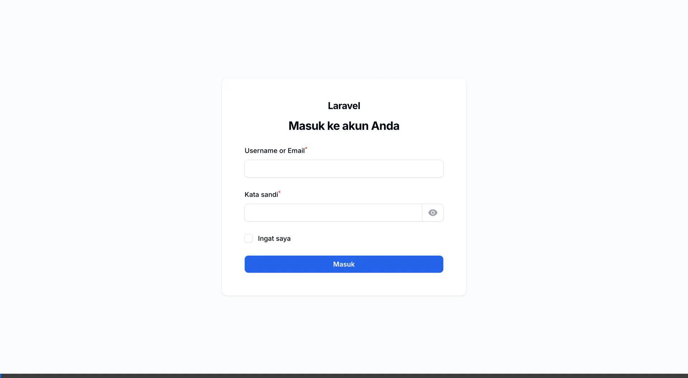
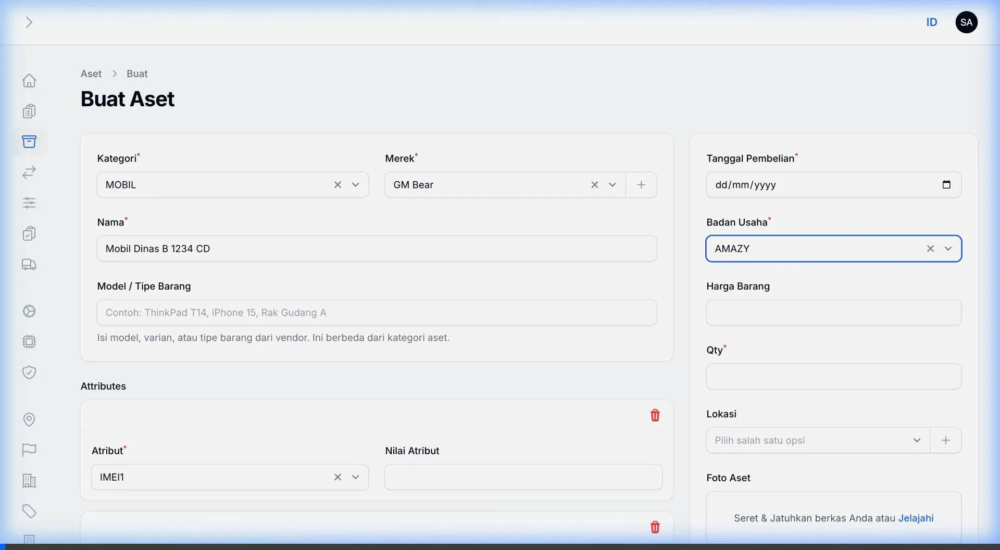

# Panduan Penggunaan Custom Attribute: Pengingat Dokumen (STNK, KIR, dll.)

Dokumentasi ini menjelaskan langkah-demi-langkah (step-by-step) cara membuat dan menggunakan **Custom Attribute** dengan tipe **Dokumen / Masa Berlaku**. Fitur ini sangat berguna untuk memberikan pengingat harian terkait dokumen yang memiliki masa berlaku, seperti STNK Mobil, KIR, Kontrak, atau dokumen perizinan lainnya.

---

## 1. Konfigurasi Custom Attribute (Admin Setup)

Langkah pertama adalah membuat atribut baru di sistem agar bisa digunakan pada form pendataan Aset. Pada contoh ini, kita membuat Atribut untuk **Dokumen STNK Mobil**.

### Langkah-langkah:
1. Login ke sistem admin di `http://web-shelf.test/admin/login` (atau alamat sistem yang sesuai) menggunakan akun berhak akses Admin.
2. Pada menu sidebar sebelah kiri, klik menu **Custom Asset Attributes**.
3. Klik tombol **New Custom Asset Attribute** (Buat Atribut Baru).
4. Isi form pembuatan atribut:
   - **Nama Atribut**: Isi dengan nama dokumen, misalnya `Dokumen STNK Mobil`.
   - **Tipe Input**: Pilih `Dokumen / Masa Berlaku`.
   - **Aktifkan Pengingat**: Klik toggle (tombol geser) hingga menyala.
   - **Pola Pengingat**: Pilih `Harian sebelum tanggal berlaku habis`.
   - **Mulai Pengingat H-**: Isi dengan angka, misalnya `30` (sistem akan mengirim notifikasi 30 hari berturut-turut sebelum dokumen hangus).
   - **Kirim Lewat**: Pilih channel pengiriman, misalnya `WhatsApp`.
   - **Penerima Internal**: Pilih user atau karyawan yang akan menerima notifikasi via WhatsApp/Email.
   - **Kategori**: Pilih kategori aset yang relevan. Misalnya untuk STNK, pilih `MOBIL` (atau Kendaraan).
   - **Wajib Diisi**: Nyalakan jika setiap aset Mobil harus melampirkan STNK.
5. Klik **Create** (atau **Simpan**) di bagian bawah halaman.

### 🎥 Video Panduan Pembuatan Atribut
Berikut adalah rekaman interaksi step-by-step pembuatan Custom Attribute di sistem:

> [!NOTE]
> Setelah atribut disimpan, seluruh aset yang berada dalam kategori yang dipilih (misal: MOBIL) akan secara otomatis meminta data dokumen STNK ini.

---

## 2. Pengisian Data pada Aset (Operasional)

Setelah atribut siap, langkah selanjutnya adalah mengisi data atribut dokumen tersebut saat membuat atau mengedit Aset.

### Langkah-langkah:
1. Pada menu sidebar sebelah kiri, klik menu **Assets** (Aset).
2. Klik tombol **New Asset** (Buat Aset Baru) atau edit aset yang sudah ada.
3. Isi informasi dasar aset, pastikan **Kategori** yang dipilih sesuai dengan kategori pada langkah pertama (misalnya `MOBIL`).
4. Scroll / gulir ke bawah menuju bagian **Custom Attributes**.
5. Karena dokumen disetting wajib atau sesuai kategori, field untuk atribut (misal: `Dokumen STNK Mobil`) akan muncul (atau Anda bisa menambahkannya dengan klik **Tambah Custom Attribute**).
6. Lengkapi form dokumen yang muncul:
   - **Nomor Dokumen**: Masukkan nomor dokumen resmi, misalnya `STNK-12345` atau `B 1234 CD`.
   - **Berlaku Sampai**: Buka kalender (DatePicker) dan pilih tanggal kapan dokumen tersebut akan kedaluwarsa.
   - **Lampiran Dokumen**: (Opsional/Wajib) Upload scan atau foto dari dokumen tersebut (PDF/JPG/PNG).
   - Sistem akan otomatis menghitung **Status Pengingat** menjadi `Aman` jika masih jauh dari tanggal jatuh tempo, atau `Peringatan` jika mendekati hari H.
7. Klik **Create** / **Save** untuk menyimpan perubahan.

### 🎥 Video Panduan Pengisian Data Aset
Berikut adalah rekaman interaksi pengisian nomor dokumen, tanggal berlaku, dan file untuk atribut dokumen di form Aset:

---

## Bagaimana Pengingat (Notifikasi) Bekerja?

> [!TIP]
> **Proses Latar Belakang (Background Job)**
> Sistem (melalui perintah cron harian) akan secara otomatis mengecek setiap aset setiap harinya pada pukul 08:00 pagi.
> - Jika tanggal saat ini masuk ke dalam periode `Mulai Pengingat H-30` (30 hari sebelum **Berlaku Sampai**).
> - Maka sistem akan langsung mengirimkan pesan WhatsApp / Email kepada **Penerima Internal** yang dipilih.
> - Pengingat akan terus dikirim **setiap hari** hingga dokumen tersebut diperbarui (di-upload dokumen baru dan tanggal kedaluwarsa diperpanjang).
