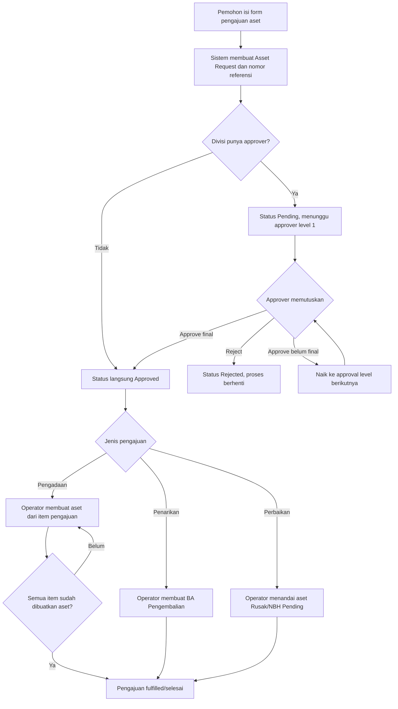
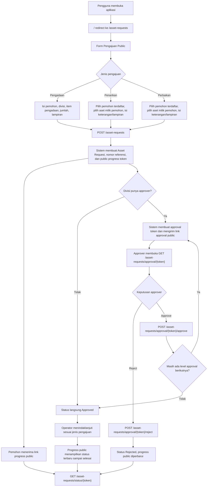
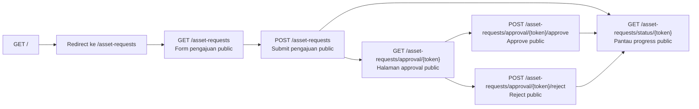
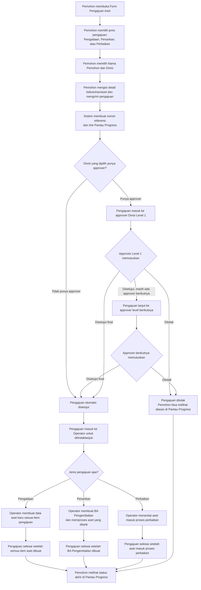
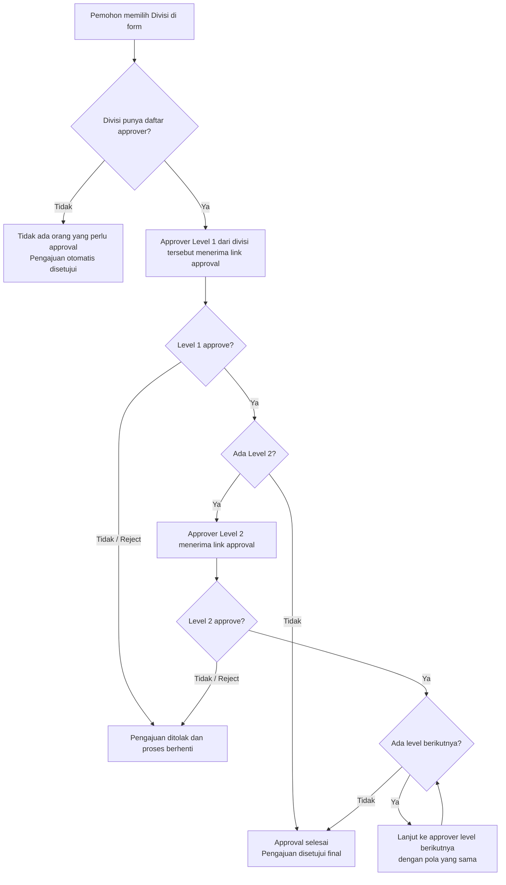
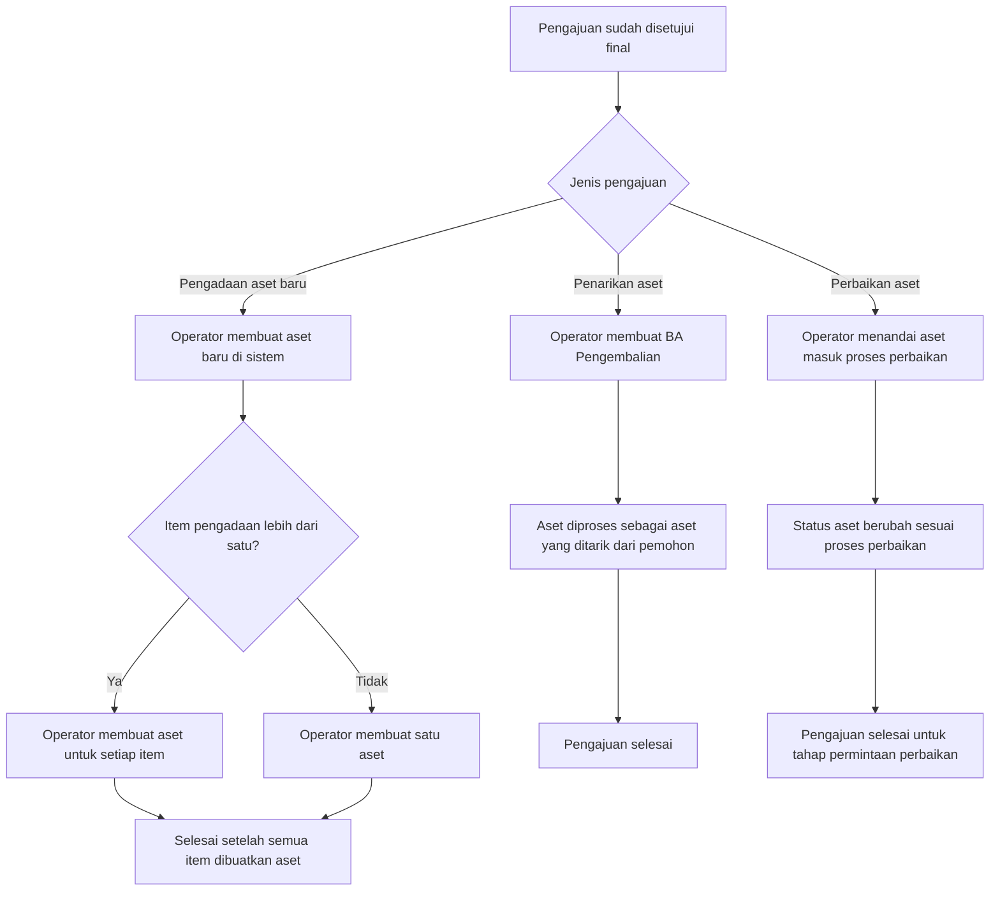

# Dokumen Handover Perubahan Asset Request Lifecycle

Tanggal: 2026-06-28  
Aplikasi: Web Shelf Complete Selular  
Area fitur: Pengajuan Aset, Approval, Tindak Lanjut Operator, Transfer Aset, Perbaikan/NBH, Dokumen PDF

## 1. Ringkasan

Perubahan kode ini membentuk alur pengajuan aset yang lebih utuh dari awal sampai selesai. Sebelumnya, proses pengajuan aset cenderung terpisah antara form, approval, pembuatan aset, transfer aset, dan perbaikan. Setelah perubahan ini, aplikasi memiliki satu benang merah:

1. Pemohon membuat pengajuan aset.
2. Sistem membuat nomor referensi dan link progress.
3. Pengajuan masuk ke approval sesuai divisi.
4. Approver menyetujui atau menolak.
5. Jika disetujui, operator melakukan tindak lanjut sesuai jenis pengajuan.
6. Sistem menandai pengajuan selesai hanya setelah tindak lanjut benar-benar selesai.
7. Pemohon dan approver bisa menerima notifikasi WhatsApp/email.
8. Admin bisa melacak status dari halaman Asset Request.

Jenis pengajuan yang didukung:

| Jenis | Tujuan | Hasil akhir |
| --- | --- | --- |
| Pengadaan | Meminta aset baru | Aset baru dibuat dan terhubung ke pengajuan |
| Penarikan | Mengembalikan aset dari pemegang ke General Affairs | BA Pengembalian dibuat dan aset kembali ke General Affairs |
| Perbaikan | Mengajukan aset untuk diperbaiki | Aset masuk status Rusak/NBH Pending, lalu bisa diselesaikan dari halaman aset |

Perbaikan terakhir yang penting:

- Pengadaan multi-item sekarang tidak ditutup setelah satu aset dibuat. Pengajuan baru dianggap selesai setelah semua item pengadaan dibuatkan aset.
- CI GitHub Actions disesuaikan ke PHP 8.4 agar sesuai dengan lockfile dependency saat ini.

## 2. Tujuan Perubahan

Tujuan utama perubahan ini adalah membuat proses pengajuan aset menjadi jelas, terlacak, dan tidak berhenti di tengah.

Secara operasional, perubahan ini menjawab kebutuhan berikut:

1. Pemohon bisa mengajukan kebutuhan aset melalui form.
2. Pengajuan memiliki nomor referensi yang bisa dipantau.
3. Approval berjalan berdasarkan divisi.
4. Request tanpa approver bisa auto-approved, tetapi tetap membutuhkan tindak lanjut operator.
5. Operator punya action lanjutan yang berbeda untuk pengadaan, penarikan, dan perbaikan.
6. Aset tidak bisa diproses ganda saat masih ada pengajuan penarikan/perbaikan aktif.
7. Dokumen BA terkait bisa diunduh setelah proses terkait selesai.
8. Status pengajuan bisa dipahami oleh pengguna non-teknis.

Secara teknis, perubahan ini membuat lifecycle lebih aman:

1. Data pengajuan dipusatkan di `asset_requests`.
2. Item pengajuan disimpan di `asset_request_items`.
3. Approval disimpan per level di `asset_request_approvals`.
4. Aset hasil pengadaan dihubungkan balik ke pengajuan melalui `asset_request_id`.
5. Penarikan dihubungkan ke `asset_transfers`.
6. Fulfillment ditandai dengan `fulfilled_at` dan `fulfilled_by_user_id`.
7. Untuk multi-item pengadaan, setiap item memiliki `fulfilled_asset_id` dan `fulfilled_at`.

## 3. Istilah Penting

| Istilah | Arti |
| --- | --- |
| Pemohon | User yang mengajukan aset |
| Approver | User yang menyetujui atau menolak pengajuan pada level tertentu |
| Operator | Admin/staf yang menindaklanjuti pengajuan setelah disetujui |
| General Affairs | Role khusus yang menjadi pusat keluar/masuk aset |
| Asset Request | Data utama pengajuan aset |
| Asset Request Item | Baris item/aset dalam satu pengajuan |
| Approval Level | Urutan persetujuan berdasarkan divisi |
| Fulfillment | Tindak lanjut operator setelah pengajuan disetujui |
| Public Progress Link | Link token untuk melihat progress pengajuan |
| Public Approval Link | Link token untuk approver memutuskan pengajuan |
| BA | Berita Acara |
| BAPEB | Berita Acara Pengembalian Barang |
| NBH | Status proses insiden/perbaikan aset |

## 4. Gambaran Besar Alur Aplikasi



### 4.1 Diagram Jalur Public End-to-End

Diagram ini menegaskan bahwa tiga aktivitas utama pengguna berjalan lewat jalur public:

1. Pengajuan aset.
2. Pantau progress pengajuan.
3. Approval pengajuan.



### 4.2 Diagram Ringkas Per Route Public



### 4.3 Diagram Alur Untuk Pengguna Non-Teknis

Diagram ini menjelaskan alur dari sudut pandang pengguna, bukan dari sisi route atau kode.

#### 4.3.1 Alur Umum Pengajuan Sampai Selesai



#### 4.3.2 Siapa Yang Melakukan Approval?

Approval ditentukan dari **Divisi** yang dipilih di form.



Penjelasan sederhana:

1. Pemohon tidak memilih approver satu per satu.
2. Approver otomatis mengikuti konfigurasi Divisi.
3. Kalau ada lebih dari satu level, approval berjalan berurutan.
4. Jika salah satu approver menolak, pengajuan berhenti dan status menjadi ditolak.
5. Jika semua approver menyetujui, pengajuan masuk ke Operator.

#### 4.3.3 Setelah Disetujui, Apa Yang Terjadi?



## 5. Peran dan Tanggung Jawab

### 5.1 Pemohon

Pemohon bertugas:

1. Membuka form pengajuan aset.
2. Memilih jenis pengajuan.
3. Mengisi data pemohon dan kontak.
4. Mengisi detail aset atau item.
5. Mengirim pengajuan.
6. Menyimpan nomor referensi atau membuka link progress.

Pemohon tidak bertugas:

- Menyetujui pengajuan sendiri.
- Membuat aset di admin.
- Membuat BA pengembalian.
- Mengubah status perbaikan.

### 5.2 Approver

Approver bertugas:

1. Membuka link approval dari notifikasi.
2. Membaca detail pengajuan.
3. Menyetujui atau menolak.
4. Mengisi catatan jika menolak.

Catatan penting:

- Link approval bersifat rahasia karena link tersebut mewakili hak keputusan approver.
- Jika pengajuan sudah diputuskan atau bukan level aktif, link tidak bisa dipakai lagi.

### 5.3 Operator/Admin

Operator bertugas setelah pengajuan disetujui:

| Jenis pengajuan | Tugas operator |
| --- | --- |
| Pengadaan | Membuat data aset dari item pengajuan |
| Penarikan | Membuat BA pengembalian ke General Affairs |
| Perbaikan | Menandai aset Rusak/NBH Pending |

Operator juga dapat:

- Membuka halaman Asset Request.
- Melihat lifecycle pengajuan.
- Mengirim ulang notifikasi ke approver.
- Mengirim ulang progress ke pemohon.
- Mengunduh dokumen BA setelah proses selesai.

### 5.4 General Affairs

General Affairs berperan dalam transfer aset:

1. Jika aset keluar dari General Affairs ke user, dokumen menjadi BA Serah Terima.
2. Jika aset berpindah antar user non-General Affairs, dokumen menjadi BA Pengalihan Barang.
3. Jika aset kembali ke General Affairs, dokumen menjadi BA Pengembalian Barang.

Untuk penarikan aset, penerima pengembalian wajib user dengan role General Affairs.

## 6. Alur Penggunaan Step-by-Step

Bagian ini adalah bagian utama handover untuk pengguna operasional.

### 6.1 Membuat Pengajuan Pengadaan Aset Baru

Gunakan alur ini saat pemohon membutuhkan aset baru, misalnya laptop, monitor, handphone, kendaraan, atau perlengkapan operasional lain.

Langkah pemohon:

1. Buka form pengajuan aset.
2. Pilih jenis pengajuan: `Pengadaan Aset Baru`.
3. Pilih nama pemohon.
   - Jika pemohon sudah login dan terdaftar, sistem hanya menampilkan data pemohon yang sesuai.
   - Jika pemohon belum terdaftar, pilih opsi manual/lainnya dan isi data pemohon.
4. Isi kontak pemohon.
   - WhatsApp diperlukan untuk notifikasi.
   - Email diperlukan untuk notifikasi.
   - Jika user terdaftar sudah punya kontak lengkap, field kontak tidak perlu muncul lagi.
5. Pilih badan usaha.
6. Pilih divisi.
7. Isi item pengadaan.
   - Untuk satu item: isi nama aset dan jumlah.
   - Untuk banyak item: tambahkan baris item pengadaan.
8. Isi keterangan kebutuhan.
9. Upload lampiran jika ada.
10. Klik submit.

Setelah submit berhasil:

1. Sistem membuat satu nomor referensi, misalnya `REQ-2026-001`.
2. Sistem membuat link progress publik.
3. Sistem menentukan status awal:
   - `Pending` jika divisi punya approver.
   - `Approved` jika divisi tidak punya approver.
4. Pemohon melihat informasi tahap berikutnya.
5. Notifikasi dikirim ke pemohon dan/atau approver jika kontak tersedia.

Contoh pengadaan multi-item:

| Item | Jumlah |
| --- | ---: |
| Macbook Air M2 | 2 |
| Monitor 27 inch | 3 |

Sistem tetap membuat satu pengajuan dengan dua item. Operator harus membuat aset untuk masing-masing item.

Perilaku penting setelah perbaikan terakhir:

1. Jika operator baru membuat aset untuk `Macbook Air M2`, pengajuan belum selesai.
2. Sistem menandai item `Macbook Air M2` sudah fulfilled.
3. Action buat aset masih tersedia untuk item berikutnya.
4. Saat operator membuka pembuatan aset lagi, form otomatis mengisi `Monitor 27 inch`.
5. Pengajuan baru dianggap selesai setelah semua item memiliki aset.

### 6.2 Approval Pengadaan

Jika divisi punya approver:

1. Approver level 1 menerima link approval.
2. Approver membuka link.
3. Halaman approval menampilkan:
   - Nomor referensi.
   - Nama pemohon.
   - Divisi.
   - Item pengajuan.
   - Catatan/keterangan.
4. Approver memilih:
   - `Setujui`, catatan opsional.
   - `Tolak`, catatan wajib.
5. Jika ada level berikutnya, pengajuan lanjut ke level berikutnya.
6. Jika tidak ada level berikutnya, pengajuan menjadi `Approved`.

Jika ditolak:

1. Status menjadi `Rejected`.
2. Alasan penolakan tersimpan.
3. Tidak ada tindak lanjut operator.

### 6.3 Tindak Lanjut Pengadaan oleh Operator

Setelah pengajuan berstatus `Approved`, operator melakukan pembuatan aset.

Langkah operator:

1. Masuk ke admin panel.
2. Buka menu `Asset Requests`.
3. Cari nomor referensi pengajuan.
4. Pastikan status `Approved`.
5. Klik action `Lanjutkan: Buat Aset`.
6. Sistem membuka halaman create asset.
7. Form asset otomatis terisi dari item pengajuan:
   - Nama aset.
   - Jumlah.
   - Badan usaha pemohon.
   - Tanggal pembelian default hari ini.
   - Status aset default tersedia.
8. Operator melengkapi field aset lain:
   - Kategori.
   - Brand.
   - Lokasi.
   - Serial number/IMEI jika ada.
   - Foto aset.
   - Atribut custom.
9. Simpan aset.

Jika pengajuan hanya satu item:

1. Setelah aset disimpan, pengajuan langsung fulfilled.
2. Status tindak lanjut menjadi selesai.
3. BA Pengadaan dapat diunduh jika tersedia di halaman detail.

Jika pengajuan banyak item:

1. Setelah aset pertama disimpan, pengajuan belum fulfilled.
2. Operator kembali ke detail pengajuan.
3. Klik lagi `Lanjutkan: Buat Aset`.
4. Sistem mengisi item berikutnya.
5. Ulangi sampai semua item dibuatkan aset.
6. Setelah item terakhir dibuat, pengajuan fulfilled.

### 6.4 Membuat Pengajuan Penarikan Aset

Gunakan alur ini saat aset perlu ditarik kembali dari pemegang aset, misalnya user resign, pindah divisi, atau aset tidak lagi digunakan.

Langkah pemohon:

1. Buka form pengajuan aset.
2. Pilih jenis pengajuan: `Penarikan Aset`.
3. Pilih pemohon terdaftar.
4. Sistem menampilkan aset milik pemohon tersebut.
5. Pilih satu atau beberapa aset yang akan ditarik.
6. Isi divisi dan keterangan.
7. Submit.

Perilaku aplikasi:

1. Aset yang dipilih harus benar-benar dimiliki oleh pemohon.
2. Aset yang sedang punya pengajuan penarikan/perbaikan aktif tidak bisa dipilih lagi.
3. Pengajuan bisa berisi beberapa aset dalam satu nomor referensi.
4. Setelah disetujui, operator harus membuat BA Pengembalian.

### 6.5 Approval Penarikan

Approval penarikan sama seperti pengadaan:

1. Masuk ke approver level 1.
2. Jika disetujui dan masih ada level berikutnya, lanjut ke level berikutnya.
3. Jika final approved, status menjadi `Approved`.
4. Jika ditolak, status menjadi `Rejected`.

### 6.6 Tindak Lanjut Penarikan oleh Operator

Setelah pengajuan penarikan berstatus `Approved`, operator membuat BA Pengembalian.

Langkah operator:

1. Masuk ke admin panel.
2. Buka menu `Asset Requests`.
3. Buka pengajuan penarikan yang sudah approved.
4. Klik `Lanjutkan: Buat BA`.
5. Sistem membuka halaman create Asset Transfer.
6. Form transfer otomatis terisi:
   - Dari user pemegang aset.
   - Ke user General Affairs.
   - Detail aset yang ditarik.
   - Tanggal transfer.
   - Nomor surat berdasarkan business entity.
7. Operator verifikasi data.
8. Simpan BA.

Setelah BA disimpan:

1. Sistem membuat `AssetTransfer`.
2. Sistem membuat detail asset transfer untuk semua aset dalam pengajuan.
3. Sistem memutasi pemegang aset ke General Affairs.
4. Status aset kembali menjadi tersedia jika masuk ke General Affairs.
5. Pengajuan ditandai fulfilled.
6. Link BA Pengembalian tampil di detail Asset Request.

Catatan penting:

- Semua aset dalam satu pengajuan penarikan harus berasal dari pemegang yang sama.
- Penerima pengembalian harus user dengan role General Affairs.
- BA yang dibuat untuk alur ini adalah `BERITA ACARA PENGEMBALIAN BARANG`.

### 6.7 Membuat Pengajuan Perbaikan Aset

Gunakan alur ini saat aset rusak atau perlu diperbaiki.

Langkah pemohon:

1. Buka form pengajuan aset.
2. Pilih jenis pengajuan: `Perbaikan Aset`.
3. Pilih pemohon terdaftar.
4. Sistem menampilkan aset milik pemohon tersebut.
5. Pilih aset yang perlu diperbaiki.
6. Isi keterangan kerusakan atau kebutuhan perbaikan.
7. Submit.

Perilaku aplikasi:

1. Aset harus milik pemohon.
2. Aset yang sedang dalam pengajuan aktif tidak bisa diajukan lagi.
3. Setelah disetujui, operator menandai aset sebagai rusak.

### 6.8 Tindak Lanjut Perbaikan oleh Operator

Setelah pengajuan perbaikan berstatus `Approved`, operator melakukan tindak lanjut awal.

Langkah operator:

1. Masuk ke admin panel.
2. Buka menu `Asset Requests`.
3. Buka pengajuan perbaikan yang approved.
4. Klik `Lanjutkan: Tandai Perbaikan`.
5. Konfirmasi action.

Setelah dikonfirmasi:

1. Aset berubah menjadi status `Damaged/Rusak`.
2. NBH status menjadi `Pending`.
3. Pengajuan ditandai fulfilled karena request sudah masuk proses perbaikan.
4. Tahap berikutnya dilakukan dari halaman aset.

### 6.9 Menyelesaikan Perbaikan dari Halaman Aset

Setelah aset masuk status rusak dan NBH pending:

1. Operator buka menu `Assets`.
2. Cari aset yang sedang rusak.
3. Klik action `Selesaikan Perbaikan`.
4. Isi data penyelesaian:
   - Tanggal selesai.
   - Penanggung jawab.
   - Bukti perbaikan atau dokumen audit.
   - Dokumen NBH/bukti penutupan.
   - Catatan penyelesaian.
5. Simpan.

Setelah disimpan:

1. NBH status menjadi `Resolved`.
2. Aset kembali ke status operasional.
3. Jika aset tidak punya pemegang non-General Affairs, status bisa menjadi `Available`.
4. Jika aset masih tercatat pada user pemegang, status bisa menjadi `Transferred`.
5. Dokumen audit/NBH tersimpan di aset.

## 7. Status dan Tahapan yang Dilihat Pengguna

### 7.1 Status Approval

| Status | Arti untuk pengguna |
| --- | --- |
| Pending | Menunggu keputusan approver |
| Approved | Sudah disetujui, menunggu tindak lanjut operator |
| Rejected | Ditolak, tidak ada proses lanjutan |

### 7.2 Status Lifecycle

| Kondisi | Tampilan tahap |
| --- | --- |
| Pending | Menunggu Persetujuan |
| Rejected | Ditolak |
| Pengadaan approved belum selesai | Disetujui - Perlu Buat Aset |
| Penarikan approved belum selesai | Disetujui - Perlu BA Pengembalian |
| Perbaikan approved belum selesai | Disetujui - Perlu Tandai Perbaikan |
| Pengadaan fulfilled | Selesai - Aset Dibuat |
| Penarikan fulfilled | Selesai - Aset Ditarik |
| Perbaikan fulfilled | Selesai - Masuk Proses Perbaikan |

### 7.3 Status Tindak Lanjut

| Status tindak lanjut | Arti |
| --- | --- |
| Belum selesai | Pengajuan sudah approved tetapi operator belum menyelesaikan action lanjutan |
| Selesai | Operator sudah melakukan action lanjutan |

Untuk pengadaan multi-item, `Selesai` baru muncul setelah semua item dibuatkan aset.

## 8. Halaman yang Dipakai Pengguna

### 8.1 Form Publik Pengajuan Aset

Route:

- `GET /asset-requests`
- `POST /asset-requests`

Fungsi:

1. Membuat pengajuan pengadaan, penarikan, atau perbaikan.
2. Menampilkan field yang berbeda sesuai jenis pengajuan.
3. Mengirim file lampiran.
4. Mengembalikan nomor referensi dan link progress.

Catatan:

- Form public bisa diakses tanpa login.
- Tanpa login, pengguna tetap bisa melihat daftar pemohon dan aset agar penarikan/perbaikan bisa dipilih dari jalur public.
- Penarikan/perbaikan tetap membutuhkan pemohon terdaftar karena aset yang diproses harus aset milik pemohon tersebut.
- Jika pengguna sudah login, form otomatis memilih akun login sebagai pemohon default, tetapi daftar pemohon lain tetap tersedia.

### 8.2 Halaman Progress Publik

Route:

- `GET /asset-requests/status/{token}`

Fungsi:

1. Menampilkan status pengajuan.
2. Menampilkan tahap lifecycle.
3. Menampilkan langkah berikutnya.
4. Menampilkan item pengajuan.
5. Menampilkan approval yang sudah atau belum diputuskan.
6. Menampilkan status tindak lanjut operator.

Token pada URL adalah akses rahasia untuk melihat progress.

### 8.3 Halaman Approval Publik

Route:

- `GET /asset-requests/approval/{token}`
- `POST /asset-requests/approval/{token}/approve`
- `POST /asset-requests/approval/{token}/reject`

Fungsi:

1. Approver melihat ringkasan pengajuan.
2. Approver menyetujui atau menolak.
3. Sistem memastikan link hanya aktif untuk approval level yang sedang pending.

Catatan:

- Approval tidak membutuhkan login di halaman ini, tetapi membutuhkan token.
- Token approval harus dijaga seperti akses pribadi.

### 8.4 Admin Asset Requests

Fungsi utama:

1. Melihat daftar pengajuan.
2. Filter berdasarkan jenis dan status.
3. Melihat detail pengajuan.
4. Approve/reject dari admin jika user login adalah approver aktif.
5. Kirim ulang notifikasi approval.
6. Kirim ulang notifikasi progress ke pemohon.
7. Menjalankan action tindak lanjut:
   - Buat aset.
   - Buat BA.
   - Tandai perbaikan.
8. Download BA Pengadaan setelah selesai.

### 8.5 Admin Assets

Dipakai untuk:

1. Membuat aset dari pengajuan pengadaan.
2. Melihat aset hasil pengadaan.
3. Menyelesaikan perbaikan/NBH.
4. Melihat status aset setelah mutasi atau perbaikan.

### 8.6 Admin Asset Transfers

Dipakai untuk:

1. Membuat BA pengembalian untuk penarikan.
2. Melihat dokumen transfer.
3. Memastikan aset berpindah sesuai pemegang.

## 9. Notifikasi

Notifikasi dikirim melalui:

1. WhatsApp, jika nomor tersedia dan konfigurasi Fonnte lengkap.
2. Email, jika email tersedia dan valid.

Notifikasi yang didukung:

| Momen | Penerima | Isi utama |
| --- | --- | --- |
| Pengajuan dibuat | Pemohon | Nomor referensi, status awal, link progress |
| Butuh approval | Approver aktif | Detail pengajuan, link approval, link progress |
| Approval naik level | Approver berikutnya | Informasi pengajuan perlu disetujui |
| Approval level sebelumnya disetujui | Pemohon | Update status approval |
| Final approved | Pemohon | Pengajuan disetujui, menunggu operator |
| Rejected | Pemohon | Pengajuan ditolak dan alasan |
| Reminder approval | Approver aktif | Link approval aktif |
| Reminder progress | Pemohon | Status terbaru dan link progress |

Catatan operasional:

- Kegagalan kirim WhatsApp/email tidak membatalkan status pengajuan.
- Sistem mencatat kegagalan pengiriman ke log.

## 10. Dokumen dan PDF

Dokumen yang tersedia:

| Dokumen | Kapan tersedia | Route |
| --- | --- | --- |
| PDF Asset Transfer | Setelah transfer dibuat | `/asset-transfer/{id}/download` |
| PDF Task Completion | Untuk task completion | `/task-completion/{id}/download` |
| Preview Task Completion | Untuk preview task | `/task-completion/{id}/preview` |
| PDF BA Pengadaan | Setelah pengadaan fulfilled | `/pengadaan/{id}/download` |

Semua route PDF membutuhkan login.

Untuk BA Pengadaan:

1. Data diambil dari Asset Request.
2. Aset yang dibuat dari pengajuan ditampilkan.
3. Header/letterhead diambil dari business entity aset pertama jika tersedia.
4. Jika tidak ada letterhead, memakai default.

## 11. Perilaku Penguncian Aset

Penguncian aset mencegah aset yang sama diproses dua kali.

Aset terkunci jika:

1. Masuk pengajuan penarikan aktif.
2. Masuk pengajuan perbaikan aktif.
3. Status pengajuan masih `Pending` atau `Approved`.
4. Belum fulfilled.

Aset tidak terkunci lagi jika:

1. Pengajuan ditolak.
2. Pengajuan sudah fulfilled.

Dampak ke pengguna:

1. Aset yang sedang diproses tidak muncul sebagai opsi transfer umum.
2. Aset yang sedang diproses tidak bisa diajukan lagi untuk penarikan/perbaikan.
3. Setelah tindak lanjut selesai, aset bisa muncul lagi sesuai statusnya.

## 12. Behavior Khusus per Jenis Transfer

Sistem menentukan jenis dokumen transfer dari role user pemberi dan penerima.

| Dari | Ke | Jenis dokumen |
| --- | --- | --- |
| General Affairs | Non-General Affairs | BA Serah Terima |
| Non-General Affairs | Non-General Affairs | BA Pengalihan Barang |
| Non-General Affairs | General Affairs | BA Pengembalian Barang |

Perilaku aset setelah transfer:

1. Jika kembali ke General Affairs, status aset menjadi `Available`.
2. Jika berpindah ke user non-General Affairs, status aset menjadi `Transferred`.
3. Jika aset sedang incident/rusak, transfer ditolak.
4. Jika aset bukan milik pemberi transfer, transfer ditolak.
5. Jika detail transfer kosong atau duplikat, transfer ditolak.

## 13. Handover Operasional untuk Pengguna

Bagian ini dapat dipakai saat menyerahkan fitur ke pengguna bisnis/admin.

### 13.1 Yang Harus Disiapkan Sebelum Dipakai

1. Data user sudah benar.
2. User pemohon punya WhatsApp dan email jika ingin menerima notifikasi.
3. Data business entity sudah ada.
4. Data divisi sudah ada.
5. Approver per divisi sudah dikonfigurasi.
6. User General Affairs sudah ada dan punya role `general_affair`.
7. Permission admin sudah digenerate.
8. Nomor/format surat business entity sudah benar.
9. Konfigurasi email dan WhatsApp sudah tersedia jika notifikasi akan dipakai.

### 13.2 Cara Menjelaskan ke Pemohon

Kalimat sederhana:

> Sekarang setiap pengajuan aset punya nomor referensi dan link progress. Setelah submit, pengajuan akan masuk approval sesuai divisi. Jika sudah disetujui, tim operator akan menindaklanjuti sesuai jenis pengajuan.

Untuk pengadaan:

> Jika mengajukan lebih dari satu item, pengajuan tetap satu nomor referensi. Tim operator akan membuat data aset satu per satu sampai semua item selesai.

Untuk penarikan:

> Pilih aset yang ingin ditarik. Setelah disetujui, operator akan membuat BA pengembalian dan aset kembali ke General Affairs.

Untuk perbaikan:

> Pilih aset yang rusak. Setelah disetujui, operator akan menandai aset masuk proses perbaikan.

### 13.3 Cara Menjelaskan ke Approver

Kalimat sederhana:

> Approver akan menerima link approval. Buka link tersebut, cek detail pengajuan, lalu pilih Setujui atau Tolak. Jika menolak, alasan wajib diisi.

Hal yang harus ditekankan:

1. Jangan membagikan link approval ke orang lain.
2. Link hanya berlaku untuk level approval yang sedang aktif.
3. Setelah keputusan dibuat, link tidak bisa dipakai lagi untuk mengubah keputusan.

### 13.4 Cara Menjelaskan ke Operator

Kalimat sederhana:

> Tugas operator dimulai setelah status pengajuan Approved. Buka Asset Requests, lalu jalankan action lanjutan sesuai jenis pengajuan.

Checklist operator:

| Jenis | Action | Setelah action |
| --- | --- | --- |
| Pengadaan | Lanjutkan: Buat Aset | Cek apakah masih ada item yang belum dibuat |
| Penarikan | Lanjutkan: Buat BA | Pastikan penerima adalah General Affairs |
| Perbaikan | Lanjutkan: Tandai Perbaikan | Lanjutkan penyelesaian dari halaman aset jika perbaikan selesai |

Untuk pengadaan multi-item:

1. Jangan berhenti setelah membuat aset pertama.
2. Kembali ke detail pengajuan.
3. Jika action `Lanjutkan: Buat Aset` masih muncul, masih ada item yang belum selesai.
4. Ulangi sampai action tidak muncul dan status tindak lanjut menjadi selesai.

## 14. Skenario Uji Manual untuk User Acceptance Test

### 14.1 Pengadaan Satu Item

1. Buat pengajuan pengadaan satu item.
2. Approve sampai final.
3. Login sebagai operator.
4. Klik `Lanjutkan: Buat Aset`.
5. Simpan aset.
6. Pastikan pengajuan menjadi fulfilled.
7. Pastikan aset terhubung ke pengajuan.
8. Pastikan BA Pengadaan bisa diunduh jika permission tersedia.

Hasil yang diharapkan:

- Status approval `Approved`.
- Status tindak lanjut `Selesai`.
- Aset muncul di daftar aset.

### 14.2 Pengadaan Multi-Item

1. Buat pengajuan dengan dua item, misalnya laptop dan monitor.
2. Approve sampai final.
3. Buat aset pertama.
4. Kembali ke detail pengajuan.
5. Pastikan pengajuan belum fulfilled.
6. Klik lagi `Lanjutkan: Buat Aset`.
7. Pastikan form berisi item kedua.
8. Simpan aset kedua.
9. Pastikan pengajuan fulfilled.

Hasil yang diharapkan:

- Item pertama punya `fulfilled_asset_id`.
- Item kedua baru fulfilled setelah aset kedua dibuat.
- Pengajuan selesai hanya setelah semua item fulfilled.

### 14.3 Penarikan Multi-Aset

1. Siapkan user dengan dua aset.
2. Buat pengajuan penarikan dengan dua aset.
3. Approve sampai final.
4. Klik `Lanjutkan: Buat BA`.
5. Pastikan dua aset masuk detail transfer.
6. Simpan BA.
7. Pastikan aset berpindah ke General Affairs.
8. Pastikan pengajuan fulfilled.

Hasil yang diharapkan:

- Satu BA memuat semua aset.
- Aset kembali ke General Affairs.
- Status aset menjadi tersedia.

### 14.4 Perbaikan Aset

1. Siapkan user dengan satu aset.
2. Buat pengajuan perbaikan.
3. Approve sampai final.
4. Klik `Lanjutkan: Tandai Perbaikan`.
5. Pastikan aset menjadi Rusak/NBH Pending.
6. Buka halaman aset.
7. Klik `Selesaikan Perbaikan`.
8. Upload dokumen audit/NBH.
9. Simpan.

Hasil yang diharapkan:

- Setelah langkah 5, pengajuan fulfilled.
- Setelah langkah 9, NBH menjadi resolved.
- Aset kembali ke status operasional.

### 14.5 Approval Ditolak

1. Buat pengajuan.
2. Approver membuka link approval.
3. Pilih `Tolak`.
4. Isi alasan.
5. Submit.

Hasil yang diharapkan:

- Status menjadi `Rejected`.
- Alasan tersimpan.
- Tidak ada action tindak lanjut operator.

## 15. Ringkasan Teknis

Bagian ini untuk developer/admin teknis. Pengguna operasional tidak wajib memahami bagian ini.

### 15.1 File Utama yang Berubah atau Ditambahkan

| File | Fungsi |
| --- | --- |
| `app/Http/Controllers/PublicAssetRequestController.php` | Form publik, submit pengajuan, progress, approval token |
| `app/Models/AssetRequest.php` | Lifecycle utama pengajuan, approval, fulfillment, notifikasi |
| `app/Models/AssetRequestItem.php` | Item/baris pengajuan |
| `app/Models/AssetRequestApproval.php` | Approval per level |
| `app/Models/Asset.php` | Status aset, lock request aktif, perbaikan/NBH |
| `app/Models/AssetTransfer.php` | Lifecycle transfer dan mutasi aset |
| `app/Filament/Resources/AssetRequestResource.php` | Admin UI Asset Request |
| `app/Filament/Resources/AssetResource/Pages/CreateAsset.php` | Create asset dari pengajuan pengadaan |
| `app/Filament/Resources/AssetTransferResource/Pages/CreateAssetTransfer.php` | Create BA dari pengajuan penarikan |
| `app/Http/Controllers/PdfController.php` | Download PDF BA/Pengadaan/Task |
| `routes/web.php` | Route public request, approval, PDF |
| `.github/workflows/main.yml` | CI validation dan deploy dependency |

### 15.2 Model Data Inti

`asset_requests` menyimpan:

- `reference_number`
- `public_token`
- `type`
- `user_id`
- `division_id`
- `asset_id`
- `item_name`
- `qty`
- `status`
- `current_level`
- `fulfilled_at`
- `fulfilled_by_user_id`
- `asset_transfer_id`

`asset_request_items` menyimpan:

- `asset_request_id`
- `asset_id`
- `item_name`
- `qty`
- `fulfilled_asset_id`
- `fulfilled_at`

`asset_request_approvals` menyimpan:

- `asset_request_id`
- `user_id`
- `public_token`
- `level`
- `status`
- `notes`
- `decided_by_user_id`
- `decided_at`

### 15.3 Detail Fix Multi-Item Pengadaan

Masalah sebelumnya:

1. Public form bisa membuat satu pengajuan dengan beberapa item.
2. Operator membuat satu aset.
3. Parent request langsung diberi `fulfilled_at`.
4. Akibatnya item berikutnya tidak terlihat sebagai pekerjaan yang belum selesai.

Perilaku baru:

1. Sistem mencari item pengadaan berikutnya yang belum punya `fulfilled_asset_id`.
2. Create Asset memakai item tersebut sebagai sumber prefill.
3. Setelah aset disimpan, item ditandai fulfilled.
4. Sistem mengecek apakah masih ada item yang belum fulfilled.
5. Parent request hanya diberi `fulfilled_at` jika semua item sudah fulfilled.

Metode penting:

- `nextUnfulfilledPengadaanItem()`
- `hasUnfulfilledPengadaanItems()`
- `fulfillPengadaan()`
- `markFulfilledByAsset()`
- `markPengadaanItemFulfilledByAsset()`

### 15.4 CI dan Dependency

Lockfile saat ini berisi dependency Symfony yang membutuhkan PHP 8.4.1 atau lebih baru. Karena itu workflow validasi menggunakan PHP 8.4.

Perubahan:

- `.github/workflows/main.yml`
- `php-version: '8.4'`

Catatan handover teknis:

1. Server production/staging sebaiknya memakai PHP yang kompatibel dengan lockfile.
2. Jika server tetap PHP 8.2, lockfile perlu diregenerasi dengan constraint yang cocok.
3. Jangan hanya menurunkan versi CI tanpa menyesuaikan dependency, karena `composer install` akan gagal.

## 16. Permission dan Akses

Permission dikelola melalui Filament Shield/policy.

Contoh permission yang relevan:

| Area | Permission contoh |
| --- | --- |
| Asset Request | `view_asset::request`, `view_any_asset::request`, `create_asset::request`, `update_asset::request`, `export_asset::request` |
| Asset | `view_asset`, `create_asset`, `update_asset`, `import_asset`, `export_asset` |
| Asset Transfer | `view_asset::transfer`, `create_asset::transfer`, `update_asset::transfer` |
| User | `view_user`, `create_user`, `update_user`, `import_user` |

Catatan:

- Approve/reject admin hanya muncul jika user adalah approver aktif pada level saat ini.
- PDF download membutuhkan login dan permission view terhadap record terkait.
- Public progress dan approval memakai token, bukan permission admin.

## 17. Risiko Operasional dan Cara Menghindarinya

| Risiko | Dampak | Pencegahan |
| --- | --- | --- |
| Divisi belum punya approver | Pengajuan langsung approved | Pastikan konfigurasi approver divisi sudah benar |
| User General Affairs belum ada | Penarikan tidak bisa difulfill | Buat user GA dan assign role `general_affair` |
| Kontak pemohon kosong | Notifikasi tidak terkirim | Lengkapi WhatsApp/email user |
| Link approval dibagikan | Orang lain bisa mengambil keputusan via token | Perlakukan link approval sebagai rahasia |
| Pengadaan multi-item tidak dilanjutkan | Item belum menjadi aset | Operator cek action `Lanjutkan: Buat Aset` sampai hilang |
| Server PHP tidak cocok lockfile | Deploy/CI gagal | Gunakan PHP 8.4+ atau regenerate dependency untuk PHP server |
| Business entity tidak punya format surat | Nomor BA bisa kosong/tidak sesuai | Lengkapi format di master business entity |

## 18. Checklist Handover

Gunakan checklist ini saat menyerahkan fitur ke pengguna/admin.

### 18.1 Checklist Data Master

- [ ] User pemohon tersedia.
- [ ] User approver tersedia.
- [ ] User General Affairs tersedia.
- [ ] Role `general_affair` diberikan ke user yang tepat.
- [ ] Business entity tersedia.
- [ ] Format nomor surat business entity tersedia.
- [ ] Divisi tersedia.
- [ ] Division approver sudah dikonfigurasi per level.

### 18.2 Checklist Akses

- [ ] Admin bisa login.
- [ ] Operator bisa membuka Asset Requests.
- [ ] Operator bisa membuat Asset.
- [ ] Operator bisa membuat Asset Transfer.
- [ ] Approver bisa membuka link approval.
- [ ] Pemohon bisa membuka link progress.
- [ ] PDF download bisa diakses user berhak.

### 18.3 Checklist Alur

- [ ] Pengadaan satu item berhasil sampai aset dibuat.
- [ ] Pengadaan multi-item berhasil sampai semua aset dibuat.
- [ ] Penarikan satu aset berhasil sampai BA dibuat.
- [ ] Penarikan multi-aset berhasil dalam satu BA.
- [ ] Perbaikan berhasil sampai aset Rusak/NBH Pending.
- [ ] Penyelesaian perbaikan berhasil sampai NBH Resolved.
- [ ] Rejection approval menyimpan alasan.
- [ ] Notifikasi terkirim atau failure tercatat di log.

## 19. Bukti Pengujian Otomatis

Perintah yang sudah dijalankan setelah perbaikan:

```bash
php artisan test
composer check-platform-reqs
vendor/bin/pint --test app/Models/AssetRequest.php app/Filament/Resources/AssetResource/Pages/CreateAsset.php tests/Feature/AssetRequestTest.php
```

Hasil:

- `php artisan test`: 101 tests passed, 390 assertions.
- `composer check-platform-reqs`: passed di PHP 8.4.22 lokal.
- `pint --test`: passed untuk file yang disentuh.

Test penting yang menutup bug multi-item:

- `test_multi_item_pengadaan_is_fulfilled_only_after_all_items_have_assets`

Test tersebut memastikan:

1. Pengajuan multi-item belum fulfilled setelah aset pertama dibuat.
2. Item pertama tercatat punya `fulfilled_asset_id`.
3. Form create asset berikutnya mengambil item kedua.
4. Pengajuan fulfilled setelah item terakhir dibuat.

## 20. FAQ Singkat

### Apakah pengajuan otomatis membuat aset?

Tidak. Approval hanya menyetujui kebutuhan. Pembuatan aset tetap dilakukan operator.

### Apakah satu pengajuan bisa berisi banyak item?

Bisa. Untuk pengadaan, satu pengajuan bisa berisi banyak item aset baru. Untuk penarikan/perbaikan, satu pengajuan bisa memuat satu atau beberapa aset yang dipilih.

### Kapan pengajuan dianggap selesai?

Pengajuan dianggap selesai saat tindak lanjut operator selesai:

- Pengadaan: semua item sudah dibuatkan aset.
- Penarikan: BA pengembalian sudah dibuat dan aset dimutasi.
- Perbaikan: aset sudah ditandai rusak/NBH pending.

### Kenapa perbaikan dianggap fulfilled saat aset menjadi Rusak/NBH Pending?

Karena fulfillment pengajuan perbaikan berarti request sudah diteruskan ke proses perbaikan aset. Penyelesaian perbaikan fisik dicatat dari halaman aset melalui action `Selesaikan Perbaikan`.

### Apakah link approval perlu login?

Tidak untuk halaman public approval. Link approval memakai token. Karena itu link harus dijaga dan tidak dibagikan.

### Apa yang terjadi jika divisi tidak punya approver?

Pengajuan langsung menjadi `Approved`, tetapi operator tetap harus menjalankan tindak lanjut.

### Kenapa aset tidak muncul di pilihan transfer/pengajuan?

Kemungkinan aset sedang terkunci oleh pengajuan penarikan/perbaikan aktif yang belum fulfilled.

### Apa yang harus dilakukan jika CI gagal di composer install?

Cek versi PHP. Lockfile saat ini membutuhkan PHP 8.4.1 atau lebih baru untuk beberapa dependency. CI sudah disetel ke PHP 8.4, tetapi server deploy juga perlu kompatibel.

## 21. Kesimpulan

Perubahan ini membuat alur pengajuan aset menjadi lebih lengkap dan bisa ditelusuri dari awal sampai akhir. Fokus utamanya bukan hanya membuat form pengajuan, tetapi memastikan setiap pengajuan punya lifecycle yang jelas:

1. Dibuat oleh pemohon.
2. Diputuskan oleh approver.
3. Ditindaklanjuti operator.
4. Diikat ke aset/BA/status perbaikan.
5. Bisa dilihat progress-nya.
6. Bisa diuji dan dipantau secara teknis.

Dengan dokumen ini, pengguna operasional dapat memahami urutan kerja fitur, sementara tim teknis tetap memiliki referensi file, model data, dan perilaku sistem yang menjadi dasar implementasinya.
